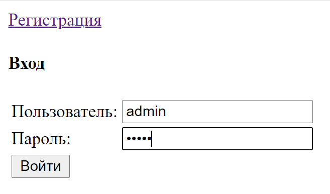
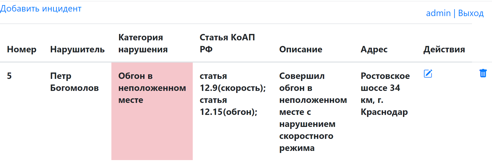

### Веб-приложение автонарушители для добавления и редактирования автонарушений

---

Описание приложения:

* Регистрация пользователя (Регистрация пользователя с одинаковым логином запрещена)

* Аутентификация пользователя

* Добавление нарушения

* Редактирование нарушения

* Удаление нарушения

---

Технологии:

* Spring (Core, MVC, Data, Security)

* Hibernate

* PostgreSQL

* Maven

* Apache Tomcat

* Jsp, Html

* Travis CI, CheckStyle

--- 

#### Страница регистрации

---

#### Страница авторизации

---

#### Главная страница

---

#### Страница добавленя нарушения

---
